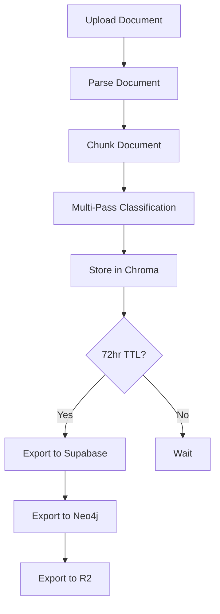

# Documentation Generation Task - Handoff to Free Model

**Date:** January 6, 2026  
**Project:** Salem Forensic Trinity - MCP Tool Platform  
**Target Model:** Gemini Flash 2.0 (free tier) or OpenRouter free models  
**Estimated Effort:** 100+ documents, ~50,000 words total  

---

## **Your Mission**

Generate comprehensive wiki-style documentation for a forensic analysis platform. Each tool, workflow, and system component needs its own markdown file with standardized structure.

**DO NOT implement code. ONLY write documentation.**

---

## **Project Overview**

This is a **forensic analysis platform for custody case evidence processing**. It ingests multi-platform messaging data (SMS, Facebook, iMessage, email, ChatGPT), performs multi-pass NLP classification to detect psychological abuse patterns (gaslighting, DARVO, parental alienation), and exports to multiple databases with court-admissible audit trails.

**Core Workflow:**
1. Upload documents (Facebook HTML, SMS XML, iMessage PDF)
2. Parse and chunk documents
3. Classify with 6-pass NLP system (spaCy, NLTK, TextBlob, Pattern Analyzer, Sentence Transformers, Aggregation)
4. Store in Chroma (72hr working memory)
5. Export to Supabase (messages), Neo4j/Graphiti (entities), R2/Directus (raw files)
6. Meta-analysis with full context after 72hr

---

## **Documentation Structure**

All documentation goes in `/docs` directory with this structure:

```
/docs
  README.md                    # Main index
  ARCHITECTURE.md              # System architecture (already exists)
  GETTING_STARTED.md           # Quick start guide
  INSTALLATION.md              # Setup instructions
  /tools                       # Individual tool docs (60+ files)
    search-web.md
    nlp-sentiment.md
    forensics-analyze-patterns.md
    ...
  /workflows                   # Workflow docs (8+ files)
    forensic-investigation.md
    document-processing.md
    ...
  /systems                     # System component docs (15+ files)
    mcp-gateway.md
    multi-pass-classifier.md
    langgraph-state-machines.md
    ...
  /guides                      # User guides (8+ files)
    uploading-documents.md
    running-analysis.md
    ...
  /api                         # API reference (5+ files)
    mcp-gateway.md
    trpc-procedures.md
    ...
```

---

## **Standard Document Template**

Every document MUST follow this structure:

```markdown
# [Tool/Workflow/System Name]

## Overview
Brief description (2-3 sentences) of what this is and why it exists.

## Purpose
What problem does this solve? What use case does it address?

## How It Works
Step-by-step explanation of the internal process.

## Parameters/Configuration
List of inputs with:
- **Name:** Parameter name
- **Type:** Data type (string, number, boolean, object)
- **Required:** Yes/No
- **Description:** What this parameter does
- **Example:** Sample value

## Return Values/Output
What does this produce? Include:
- **Type:** Return type
- **Structure:** Object shape or data format
- **Example:** Sample output

## Usage Examples

### Example 1: Basic Usage
\`\`\`typescript
// Code example with explanation
const result = await toolName({ param: value });
console.log(result);
\`\`\`

### Example 2: Advanced Usage
\`\`\`typescript
// More complex example
\`\`\`

## Related Tools/Systems
- [Tool Name](../tools/tool-name.md) - Brief description
- [Workflow Name](../workflows/workflow-name.md) - Brief description

## Troubleshooting

### Issue: [Common problem]
**Symptom:** What the user sees  
**Cause:** Why this happens  
**Solution:** How to fix it

## See Also
- [Related Doc 1](../path/to/doc1.md)
- [Related Doc 2](../path/to/doc2.md)
```

---

## **Tools to Document (60+ files)**

### Search Tools (4 files)
- `/docs/tools/search-web.md` - Web search tool
- `/docs/tools/search-semantic.md` - Semantic search tool
- `/docs/tools/search-tavily.md` - Tavily LLM-optimized search
- `/docs/tools/search-perplexity.md` - Perplexity search

### Document Tools (4 files)
- `/docs/tools/document-parse.md` - Document parsing tool
- `/docs/tools/document-ocr.md` - OCR tool
- `/docs/tools/document-extract.md` - Text extraction tool
- `/docs/tools/document-chunk.md` - Document chunking tool

### NLP Tools (8 files)
- `/docs/tools/nlp-sentiment.md` - Sentiment analysis tool
- `/docs/tools/nlp-entities.md` - Entity extraction tool
- `/docs/tools/nlp-classify.md` - Text classification tool
- `/docs/tools/nlp-summarize.md` - Summarization tool
- `/docs/tools/nlp-spacy.md` - spaCy integration (entity extraction, structure analysis)
- `/docs/tools/nlp-nltk.md` - NLTK integration (VADER sentiment, negation handling)
- `/docs/tools/nlp-textblob.md` - TextBlob integration (polarity, subjectivity, sarcasm)
- `/docs/tools/nlp-transformers.md` - Sentence Transformers (semantic similarity)

### Forensics Tools (6 files)
- `/docs/tools/forensics-analyze-patterns.md` - Pattern analysis tool (256 custom patterns)
- `/docs/tools/forensics-detect-hurtlex.md` - HurtLex detection (offensive language lexicon)
- `/docs/tools/forensics-score-severity.md` - Severity scoring (1-10 scale)
- `/docs/tools/forensics-get-modules.md` - Get analysis modules (17 modules)
- `/docs/tools/forensics-multi-pass-classifier.md` - Multi-pass NLP classifier (6 passes)
- `/docs/tools/forensics-priority-screener.md` - Priority screener (Pass 0: custody interference, child references)

### Vector Database Tools (6 files)
- `/docs/tools/vector-add.md` - Add embeddings to vector DB
- `/docs/tools/vector-search.md` - Semantic search in vector DB
- `/docs/tools/vector-delete.md` - Delete embeddings
- `/docs/tools/vector-chroma.md` - Chroma integration (72hr TTL working memory)
- `/docs/tools/vector-pgvector.md` - pgvector/Supabase integration (persistent storage)
- `/docs/tools/vector-qdrant.md` - Qdrant integration

### Graph Database Tools (6 files)
- `/docs/tools/graph-add-entity.md` - Add entity to graph (Person, Place, Organization, Event)
- `/docs/tools/graph-add-relationship.md` - Add relationship to graph (PARENT_OF, DATED, EMPLOYED_BY)
- `/docs/tools/graph-search-entities.md` - Search entities
- `/docs/tools/graph-timeline.md` - Get entity timeline
- `/docs/tools/graph-contradictions.md` - Detect contradictions
- `/docs/tools/graph-neo4j.md` - Neo4j integration
- `/docs/tools/graph-graphiti.md` - Graphiti integration (temporal knowledge graphs)

### LLM Tools (4 files)
- `/docs/tools/llm-invoke.md` - Invoke LLM
- `/docs/tools/llm-embed.md` - Generate embeddings
- `/docs/tools/llm-smart-router.md` - Smart LLM routing (task-based, cost-based, latency-based)
- `/docs/tools/llm-providers.md` - LLM provider overview (OpenAI, Gemini, Cohere, Groq, Claude, etc.)

### Format Conversion Tools (4 files)
- `/docs/tools/format-convert.md` - Format conversion tool
- `/docs/tools/format-parse.md` - Format parsing tool (SMS XML, Facebook HTML, iMessage PDF)
- `/docs/tools/format-check-schema.md` - Schema validation
- `/docs/tools/format-ocr.md` - OCR tool

### Evidence Chain Tools (7 files)
- `/docs/tools/evidence-create-chain.md` - Create evidence chain
- `/docs/tools/evidence-add-stage.md` - Add stage to chain
- `/docs/tools/evidence-verify.md` - Verify evidence integrity
- `/docs/tools/evidence-hash-file.md` - Hash file (SHA-256)
- `/docs/tools/evidence-hash-content.md` - Hash content (SHA-256)
- `/docs/tools/evidence-export.md` - Export evidence chain
- `/docs/tools/evidence-report.md` - Generate evidence report

### Text Mining Tools (1 file)
- `/docs/tools/text-mine.md` - Text mining tool (ugrep/ripgrep smart routing)

### Schema Tools (3 files)
- `/docs/tools/schema-resolve.md` - Schema resolution
- `/docs/tools/schema-apply.md` - Apply schema
- `/docs/tools/schema-cache.md` - Schema caching

---

## **Workflows to Document (8 files)**

Each workflow needs: Purpose, Steps, Input/Output, Mermaid Diagram, Examples

- `/docs/workflows/forensic-investigation.md` - 8-stage forensic investigation workflow
  * Steps: Preliminary Analysis → Export to Chroma → [CHECKPOINT] Preliminary Approval → Meta-Analysis → Detect Contradictions → Export to Neo4j → Export to Supabase → [CHECKPOINT] Meta-Analysis Approval
- `/docs/workflows/document-processing.md` - Document processing workflow (type detection → extraction → validation → storage)
- `/docs/workflows/document-analysis.md` - Document analysis workflow
- `/docs/workflows/forensic-chat-analysis.md` - Chat analysis workflow
- `/docs/workflows/semantic-search-prep.md` - Semantic search preparation
- `/docs/workflows/data-extraction-pipeline.md` - Data extraction pipeline
- `/docs/workflows/text-mining-workflow.md` - Text mining workflow
- `/docs/workflows/format-conversion-chain.md` - Format conversion chain

**Mermaid Diagram Example:**


---

## **System Components to Document (16 files)**

- `/docs/systems/mcp-gateway.md` - MCP Gateway API (4 endpoints: search_tools, describe_tool, invoke_tool, get_ref)
- `/docs/systems/plugin-system.md` - Plugin architecture
- `/docs/systems/executor.md` - Tool executor
- `/docs/systems/smart-router.md` - Smart LLM routing (task-based, cost-based, latency-based selection)
- `/docs/systems/chroma-storage.md` - Chroma working memory (72hr TTL, JSON persistence)
- `/docs/systems/supabase-integration.md` - Supabase integration (7 tables: messaging_documents, messaging_conversations, messaging_messages, messaging_behaviors, messaging_attachments, messaging_evidence_items, mcl_factors)
- `/docs/systems/neo4j-integration.md` - Neo4j/Graphiti integration (see NEO4J_GRAPH_SCHEMA_COMPLETE.md for full schema)
- `/docs/systems/r2-directus-storage.md` - R2/Directus file storage (raw files, chain of custody)
- `/docs/systems/langgraph-state-machines.md` - LangGraph workflows (state machines, conditional routing, human-in-the-loop checkpoints)
- `/docs/systems/langchain-memory.md` - LangChain memory system (hypothesis tracking, analysis deltas, temporal queries)
- `/docs/systems/llamaindex-loaders.md` - LlamaIndex document loaders (SMS, Facebook, iMessage, ChatGPT, Email)
- `/docs/systems/multi-pass-classifier.md` - Multi-pass NLP classification (6 passes: spaCy, NLTK, TextBlob, Pattern Analyzer, Sentence Transformers, Aggregation)
- `/docs/systems/pattern-library.md` - 256-pattern behavioral library (gaslighting, DARVO, parental alienation, substance abuse, infidelity, financial abuse, love bombing, medical abuse, reproductive coercion, power asymmetry)
- `/docs/systems/embedding-pipeline.md` - Embedding generation pipeline (batch processing, pgvector storage)
- `/docs/systems/audit-logging.md` - Audit trail and chain of custody (SHA-256 hashing, immutable logs, court admissibility)
- `/docs/systems/hitl-checkpoints.md` - Human-in-the-loop system (2 checkpoints: preliminary approval, meta-analysis approval)

---

## **User Guides to Document (8 files)**

- `/docs/guides/uploading-documents.md` - How to upload documents (drag-drop, format detection, "Start Analysis" button)
- `/docs/guides/running-analysis.md` - How to run forensic analysis (manual trigger after all platforms ingested)
- `/docs/guides/managing-patterns.md` - How to manage custom patterns (add/edit/delete, test against sample text)
- `/docs/guides/configuring-llm-providers.md` - How to configure LLM providers (API keys, routing rules, cost tracking)
- `/docs/guides/building-workflows.md` - How to build custom workflows (visual editor, drag-drop nodes)
- `/docs/guides/creating-agents.md` - How to create custom agents (configure tools, memory, coordination)
- `/docs/guides/exporting-results.md` - How to export analysis results (JSON, CSV, PDF reports)
- `/docs/guides/court-admissibility.md` - Ensuring court-admissible evidence (chain of custody, audit trails, SHA-256 hashing)

---

## **API Reference to Document (5 files)**

- `/docs/api/mcp-gateway.md` - MCP Gateway API reference (search_tools, describe_tool, invoke_tool, get_ref)
- `/docs/api/trpc-procedures.md` - tRPC procedures reference (auth, patterns, llm, workflows, agents, export, import)
- `/docs/api/rest-endpoints.md` - REST API endpoints
- `/docs/api/websocket-api.md` - WebSocket API (log streaming)
- `/docs/api/authentication.md` - Authentication and authorization (Manus OAuth, session cookies)

---

## **Neo4j Graph Schema (CRITICAL)**

The user uploaded `NEO4J_GRAPH_SCHEMA_COMPLETE.md` with the complete Neo4j/Graphiti schema. This document contains:

**Node Labels:**
- Person (opposing_party, child, witness, expert, family_petitioner, family_respondent, associate, romantic_interest, professional)
- Address (geocoded with lat/lon, geohash for proximity queries)
- Place (court, school, workplace, medical, business, residence)
- Organization (court_agency, employer, school, medical, legal, government)
- Property (real estate details)
- GpsPoint (timeline location records)
- Phone (wireless, landline, voip)
- Email
- VoterRecord
- Event (incidents, parenting time denial)

**Edge Types:**
- Familial: PARENT_OF, CHILD_OF, SIBLING_OF, RELATIVE_OF
- Romantic: DATED, MARRIED_TO, DIVORCED_FROM, AFFAIR_WITH
- Professional: EMPLOYED_BY, COWORKER_OF, SUPERVISED_BY
- Residential: RESIDED_AT, OWNS, HAS_PROPERTY, NEIGHBOR_OF
- Contact: HAS_PHONE, HAS_EMAIL, CONTACTED, MESSAGED
- Spatial: LOCATED_AT, NEAR, VISITED
- Temporal: OCCURRED_AT, MENTIONED_IN

**Key Features:**
- Geohash precision tiers (geohash_7: ~150m, geohash_6: ~1.2km, geohash_5: ~5km)
- Spatial indexes for fast proximity queries
- Temporal relationships with start_date/end_date
- Source tracking (source_app: "chronicle", source_urls, source_document)
- Person relevance tiers (subject, promoted, derived)
- MCL factor tagging (mcl_factors: ["J", "K"])

**YOU MUST integrate this schema into the Neo4j/Graphiti documentation files.**

---

## **Key Technical Context**

### Multi-Pass NLP Classifier (6 passes)
1. **Pass 0: Priority Screener** - Immediate flags for custody interference, child references (Kailah/Kyla), call blocking, visit blocking, parenting time denial. Automatic HIGH severity (8-10).
2. **Pass 1: spaCy** - Structure analysis, entity extraction, speaker attribution
3. **Pass 2: NLTK VADER** - Sentiment lexicons, negation handling, intensity modifiers
4. **Pass 3: Pattern Analyzer** - User's 256 custom patterns from database + built-in patterns
5. **Pass 4: TextBlob** - Polarity, subjectivity, sarcasm detection (high subjectivity + contradictory polarity)
6. **Pass 5: Sentence Transformers** - Semantic similarity to known patterns
7. **Pass 6: Aggregation** - Consensus sentiment from all sources

**Dual-Polarity Analysis:** Detect BOTH negative patterns (gaslighting, abuse) AND positive patterns (love bombing, excessive affection) to identify manipulation via contradiction.

### Pattern Library (256 patterns)
- Gaslighting (memory denial, reality distortion, blame shifting)
- DARVO (Deny, Attack, Reverse Victim/Offender)
- Overelaboration (location reporting, time reporting, justification)
- Parental Alienation (badmouthing, interference, loyalty conflicts)
- Substance Abuse (drug references, alcohol mentions, impairment)
- Infidelity (affair references, dating app mentions, secret relationships)
- Financial Abuse (withholding money, controlling access, economic coercion)
- Love Bombing (excessive affection, rapid escalation, overwhelming attention)
- Medical Abuse (medication tampering, medical neglect, Munchausen by proxy)
- Reproductive Coercion (birth control sabotage, pregnancy pressure)
- Power Asymmetry (threats, intimidation, isolation)

### Conversation Segmentation
- **Cluster ID Format:** `PLAT_YYMM_TOPIC_iii`
- **Platform Codes:** SMS, FB, IMSG, EMAIL, CHATGPT
- **Topic Codes:** KAILAH, VISITS, CUSTODY, MONEY, MEDICAL, SCHOOL, etc.
- **Segmentation:** Semantic similarity + time-window + entity-based

### LLM Provider Routing
- **Task-Based:** Code → Codex, Math → GPT-4, Speed → Groq, Multimodal → Gemini
- **Cost-Based:** Cheapest first (Groq, Cohere, OpenRouter free tier)
- **Latency-Based:** Fastest first (Groq, Gemini Flash)
- **Claude-Last Strategy:** Only use Claude for critical architecture decisions (user has spent $120 this week)

### Storage Architecture
- **Chroma:** 72hr TTL working memory for preliminary analysis (JSON persistence, auto-cleanup)
- **Supabase:** Permanent storage for messages, behaviors, evidence (7 tables, pgvector for embeddings)
- **Neo4j/Graphiti:** Entity graph with temporal relationships (see NEO4J_GRAPH_SCHEMA_COMPLETE.md)
- **R2/Directus:** Raw file storage with SHA-256 hashing (chain of custody)

### Audit Logging & Chain of Custody
- **Immutable Logs:** Append-only audit trail for court admissibility
- **SHA-256 Hashing:** File integrity verification
- **Timestamps:** All operations timestamped (UTC)
- **Analysis Provenance:** Which tool detected what, confidence scores
- **Data Lineage:** Message → Chunk → Cluster → Meta-Analysis
- **Human Validation:** 2 checkpoints (preliminary approval, meta-analysis approval)

---

## **Source Files for Reference**

You can read these files to understand implementation details:

### Core Infrastructure
- `/home/ubuntu/mcp-tool-platform/server/mcp/gateway/executor.ts` - Tool executor with 60+ registered handlers
- `/home/ubuntu/mcp-tool-platform/server/mcp/gateway/gateway.ts` - MCP Gateway API (4 endpoints)
- `/home/ubuntu/mcp-tool-platform/server/mcp/plugins/` - All plugin implementations

### NLP & Forensics
- `/home/ubuntu/mcp-tool-platform/server/lib/ai/multi-pass-classifier.ts` - 6-pass NLP classifier
- `/home/ubuntu/mcp-tool-platform/server/lib/ai/pattern-analyzer.ts` - Pattern matching engine
- `/home/ubuntu/mcp-tool-platform/server/lib/ai/nlp_runner.py` - Python NLP bridge (spaCy, NLTK, langdetect)
- `/home/ubuntu/mcp-tool-platform/server/mcp/plugins/forensics-plugin.ts` - Forensics tools

### AI Libraries
- `/home/ubuntu/mcp-tool-platform/server/mcp/orchestration/langgraph-adapter.ts` - LangGraph state machines
- `/home/ubuntu/mcp-tool-platform/server/mcp/orchestration/langchain-memory.ts` - LangChain memory
- `/home/ubuntu/mcp-tool-platform/server/mcp/loaders/` - LlamaIndex document loaders

### Database Integration
- `/home/ubuntu/mcp-tool-platform/server/mcp/plugins/pgvector-supabase.ts` - pgvector/Supabase
- `/home/ubuntu/mcp-tool-platform/server/python-tools/graphiti_runner.py` - Graphiti/Neo4j bridge
- `/home/ubuntu/mcp-tool-platform/server/mcp/plugins/chroma-plugin.ts` - Chroma working memory

### Schemas
- `/home/ubuntu/mcp-tool-platform/server/lib/ai/schemas/production-schemas.ts` - Supabase table schemas
- `/home/ubuntu/upload/NEO4J_GRAPH_SCHEMA_COMPLETE.md` - Neo4j graph schema (CRITICAL)

---

## **Your Workflow**

1. **Create directory structure:**
   ```bash
   mkdir -p /home/ubuntu/mcp-tool-platform/docs/{tools,workflows,systems,guides,api,images}
   ```

2. **Start with high-priority docs:**
   - `/docs/README.md` (main index with links to all docs)
   - `/docs/GETTING_STARTED.md` (quick start guide)
   - `/docs/systems/multi-pass-classifier.md` (core NLP system)
   - `/docs/systems/neo4j-integration.md` (integrate NEO4J_GRAPH_SCHEMA_COMPLETE.md)
   - `/docs/workflows/forensic-investigation.md` (8-stage workflow)

3. **Generate tool docs in batches:**
   - Start with forensics tools (most important)
   - Then NLP tools
   - Then database tools
   - Then utility tools

4. **Add Mermaid diagrams for workflows:**
   ```mermaid
   graph TD
       A[Start] --> B[Step 1]
       B --> C[Step 2]
   ```

5. **Add code examples for all tools:**
   ```typescript
   // Example usage
   const result = await toolName({ param: value });
   ```

6. **Cross-link related docs:**
   - Every tool should link to related tools/workflows
   - Every workflow should link to tools it uses
   - Every system should link to related systems

7. **Save all files to `/home/ubuntu/mcp-tool-platform/docs/`**

---

## **Quality Standards**

- **Clarity:** Write for users who have NEVER seen this system before
- **Completeness:** Every parameter, return value, and example must be documented
- **Accuracy:** Read source code to understand implementation details
- **Consistency:** Use the standard template for ALL documents
- **Cross-linking:** Link related docs extensively
- **Examples:** Provide 2-3 code examples per tool
- **Troubleshooting:** Include common issues and solutions

---

## **Deliverables**

When complete, you should have:
- [ ] 100+ markdown files in `/docs` directory
- [ ] Main index (`README.md`) with links to all docs
- [ ] All tools documented (60+ files)
- [ ] All workflows documented (8+ files)
- [ ] All systems documented (16+ files)
- [ ] All guides documented (8+ files)
- [ ] All API reference documented (5+ files)
- [ ] Mermaid diagrams for all workflows
- [ ] Code examples for all tools
- [ ] Neo4j schema fully integrated into graph docs

---

## **Cost Optimization**

**You are a FREE MODEL. Do NOT call expensive APIs.**

- Use Gemini Flash 2.0 (free tier) for generation
- OR use OpenRouter free models (Mistral, Groq)
- DO NOT use Claude (user has spent $120 this week)
- DO NOT use GPT-4 (expensive)

---

## **Questions?**

If you need clarification:
1. Read the source files listed above
2. Check ARCHITECTURE.md for system overview
3. Check todo.md for implementation details
4. Ask the user if still unclear

---

## **Start Here**

Begin with these 5 high-priority docs:
1. `/docs/README.md` - Main index
2. `/docs/GETTING_STARTED.md` - Quick start
3. `/docs/systems/multi-pass-classifier.md` - Core NLP
4. `/docs/systems/neo4j-integration.md` - Graph DB (integrate NEO4J_GRAPH_SCHEMA_COMPLETE.md)
5. `/docs/workflows/forensic-investigation.md` - Main workflow

**Good luck! Generate comprehensive, clear, accurate documentation.**
